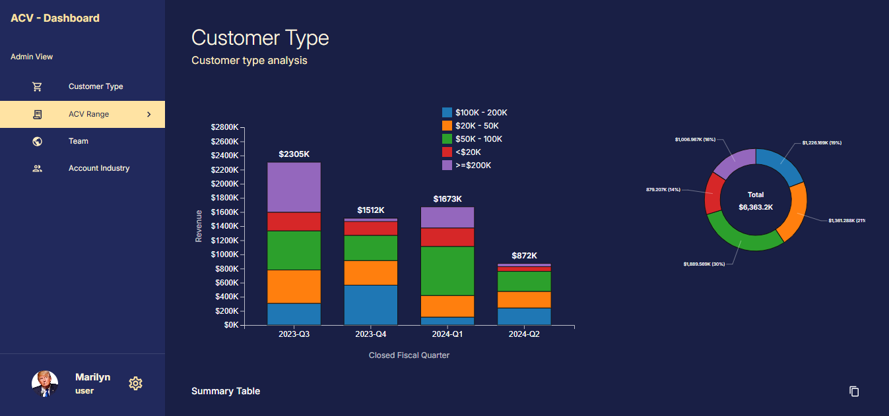

# ACV Dashboard

A full-stack web application dashboard to visualize and analyze ACV (Annual Contract Value) data. This project showcases modern frontend and backend practices, including data processing, state management, and smooth UI/UX.

---

## ✨ Special Highlight: Dark Mode / Light Mode

> 🌙 **Dark Mode / Light Mode** — Fully supported with MUI theming. Seamless switching between themes for better accessibility and comfort.

> 📱 **Fully Responsive Design** — Optimized for Desktop, Tablet, and Mobile. Every component scales and adapts fluidly to various screen sizes for a consistent experience.

---

## 📸 Project Screenshot

## 🔧 Tech Stack

### 🖥 Frontend

- **React.js**
- **Redux Toolkit Query** (for API integration)
- **Redux** (for state management)
- **Shimmer UI** (for loading states)
- **Material UI (MUI)** (for component styling)

### 🌐 Backend

- **Node.js**
- **Express.js**
- **MongoDB** (for persistent storage)

---

## 📊 Features

- Interactive **stacked bar** and **donut charts** (via D3.js)
- Dynamic table summaries with **copy-to-clipboard** functionality
- Clean error handling and fallback states
- Responsive design for desktop, tablet, and mobile
- Shimmer-based loading placeholders for a smooth user experience

---

## 📁 Data Pipeline

1. Raw JSON data is parsed into JavaScript objects.
2. Cleaned and structured data is inserted into MongoDB.
3. The backend serves this data via Express API endpoints.
4. The frontend fetches and displays the data using RTK Query.

---

## 🚀 Getting Started

### 🔌 Backend

- bash
- cd backend
- npm install
- npm run dev

## 🖥 Frontend

- cd frontend
- npm install
- npm start

## 📦 Folder Structure (Simplified)

- acv-dashboard/
- ├── backend/
- │ ├── routes/
- │ ├── models/
- │ ├── controllers/
- │ └── server.js
- ├── frontend/
- │ ├── src/
- │ │ ├── components/
- │ │ ├── pages/
- │ │ ├── state/
- │ │ └── App.js
- └── README.md

## 📌 Notes

Customize your MUI theme and D3 charts as needed

All pages handle “not found” and loading scenarios with proper feedback

For a gentle 404 page, a simple message with a "Back to Home" option is included

## 🧑‍💻 Author

Built by Pavithravignesh Sathasivam
