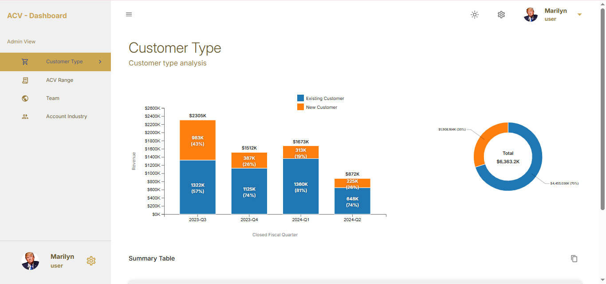
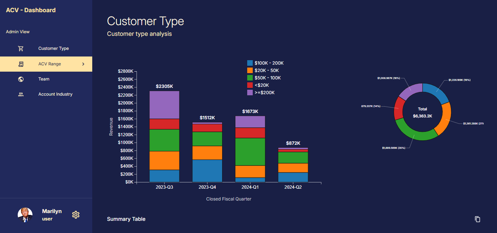
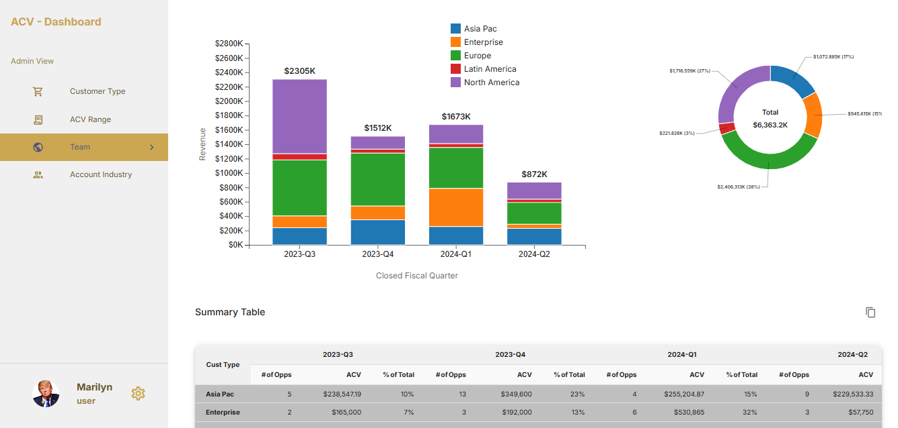
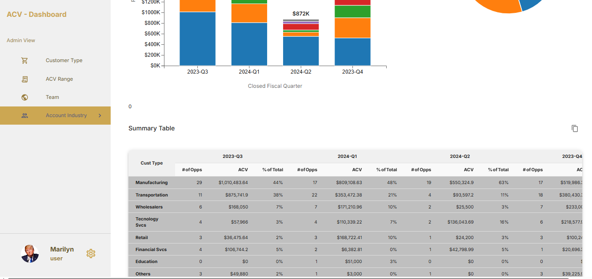
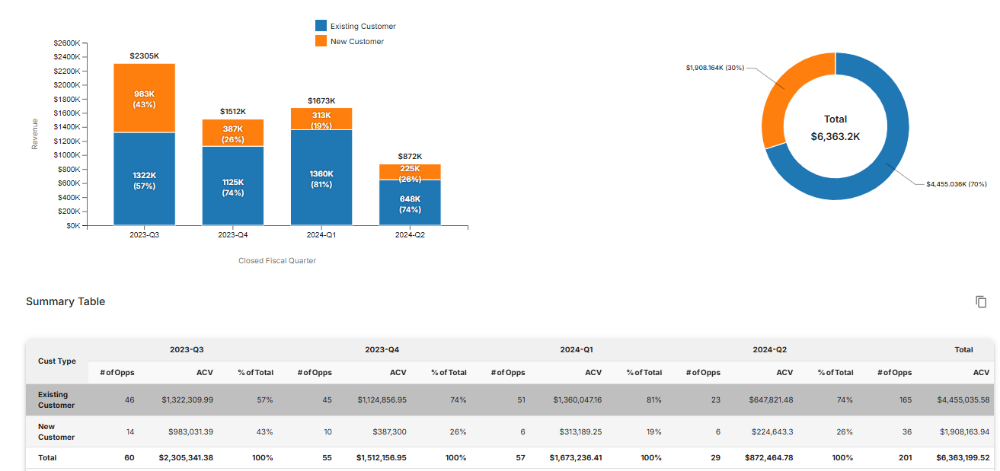
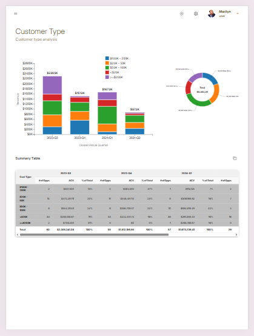
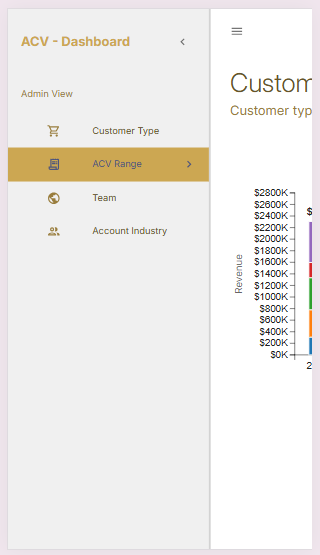

# ACV Dashboard

A full-stack web application dashboard to visualize and analyze ACV (Annual Contract Value) data. This project showcases modern frontend and backend practices, including data processing, state management, and smooth UI/UX.

---

## ✨ Special Highlight: Dark Mode / Light Mode

> 🌙 **Dark Mode / Light Mode** — Fully supported with MUI theming. Seamless switching between themes for better accessibility and comfort.

> 📱 **Fully Responsive Design** — Optimized for Desktop, Tablet, and Mobile. Every component scales and adapts fluidly to various screen sizes for a consistent experience.

---

## 📸 Project Screenshot









## 🔧 Tech Stack

### 🖥 Frontend

- **React.js**
- **Redux Toolkit Query** (for API integration)
- **Redux** (for state management)
- **Shimmer UI** (for loading states)
- **Material UI (MUI)** (for component styling)

### 🌐 Backend

- **Node.js**
- **Express.js**
- **MongoDB** (for persistent storage)

---

## 📊 Features

- Interactive **stacked bar** and **donut charts** (via D3.js)
- Dynamic table summaries with **copy-to-clipboard** functionality
- Clean error handling and fallback states
- Responsive design for desktop, tablet, and mobile
- Shimmer-based loading placeholders for a smooth user experience

---

## 📁 Data Pipeline

1. Raw JSON data is parsed into JavaScript objects.
2. Cleaned and structured data is inserted into MongoDB.
3. The backend serves this data via Express API endpoints.
4. The frontend fetches and displays the data using RTK Query.

---

## 🚀 Getting Started

Requires Node.js 18+ and a MongoDB database (local or [MongoDB Atlas](https://www.mongodb.com/atlas)).

### 🔌 Backend (`server/`)

```bash
cd server
cp .env.example .env   # then set MONGO_URL and CLIENT_URL
npm install
npm run seed           # one-time: loads the sample data (use -- --reset to reload)
npm run dev            # http://localhost:9000
```

### 🖥 Frontend (`client/`)

```bash
cd client
cp .env.example .env   # REACT_APP_BASE_URL points at the API, with a trailing slash
npm install
npm start              # http://localhost:3000
```

### Environment variables

| Where | Variable | Purpose |
| --- | --- | --- |
| server | `MONGO_URL` | MongoDB connection string |
| server | `CLIENT_URL` | Comma-separated origins allowed by CORS (e.g. your deployed frontend URL) |
| server | `PORT` | Port for local runs (default `9000`) |
| client | `REACT_APP_BASE_URL` | API base URL, ending in `/` |
| client | `REACT_APP_USER_ID` | Optional: `_id` of the demo user shown in the header |

## ☁️ Deploying (Vercel)

Deploy the API and the frontend as two Vercel projects from this repo.

1. **API**: Root Directory `server`. Set `MONGO_URL` and `CLIENT_URL` (the frontend's URL). `server/vercel.json` handles the rest. Check `/health` returns `{"status":"ok"}`.
2. **Frontend**: Root Directory `client`, framework preset Create React App. Set `REACT_APP_BASE_URL` to the API URL (with a trailing `/`). `client/vercel.json` rewrites every path to `index.html` so client-side routes work.
3. If you use MongoDB Atlas, allow access from Vercel (Network Access → `0.0.0.0/0`, or Vercel's IP ranges).
4. Run `npm run seed` once against the production database from your machine.

The API also runs as a normal Node server (`npm start`) on Render, Railway, etc.

## 🔗 API

| Method | Path | Returns |
| --- | --- | --- |
| GET | `/health` | Health check |
| GET | `/customerType/viewData` | Customer type data |
| GET | `/accountIndustry/viewData` | Account industry data |
| GET | `/acvRange/viewData` | ACV range data |
| GET | `/team/viewData` | Team data |
| GET | `/user/viewData/:id` | A user's `name` and `role` |

## 📦 Folder Structure (Simplified)

```
avc-dashboard/
├── server/
│   ├── controllers/
│   ├── data/          # sample data + rawData JSON
│   ├── models/
│   ├── routes/
│   ├── db.js
│   ├── seed.js
│   └── index.js
├── client/
│   └── src/
│       ├── components/
│       ├── scenes/
│       ├── state/
│       └── App.js
└── ReadME.md
```

## 📌 Notes

Customize your MUI theme and D3 charts as needed

All pages handle “not found” and loading scenarios with proper feedback

For a gentle 404 page, a simple message with a "Back to Home" option is included

## 🧑‍💻 Author

Built by Pavithravignesh Sathasivam
